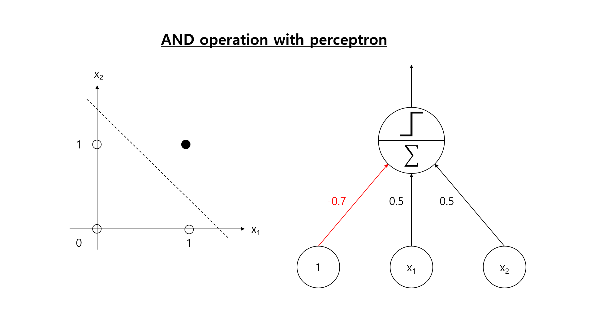

# Perceptron
## 1. What is perceptron?
The perceptron is one of the simplest artificial neural nets developed by Frank Rosenblatt in 1958 and is an algorithm that make one output from numerous inputs. And, each input connection is associated with values in the weight vector. The perceptron is called TLU(Threshold logic unit) or sometimes LTU(Linear threshold unit), it works similarly to the way neurons consisting of human brain work.

## 2. The structure of single perceptron

## 3. Logical operations with perceptron
It is easy to implement logical operation such as AND, NAND, and OR using single-layer perceptron. However, It is impossible for single-layer perceptron to learn XOR operation because that is only capable of implement functions that divide one area into two areas by one line. One solution for solving this problem is combine AND, NAND, and OR operation to make XOR operation. That is, we can make it by adding a hidden layer between the input layer and the output layer. This process is called Multilayer perceptron.

#### * AND operation with perceptron

#### * XOR operation with perceptrons

